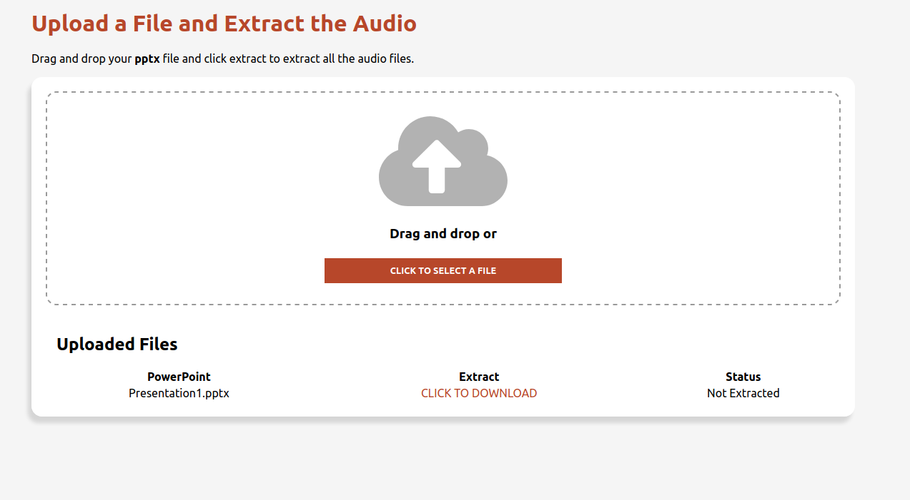

# PowerPoint-Sound-Extractor
This application was created because I had a friend who wanted a quick way to combine all of the 
audio files in a PowerPoint file.  The issue with using built-in functionality was the fact that it would take 30 
minutes to convert  one  PowerPoint (this adds up very quickly if you have 12 from a course that you need to do).  
Since underneath the hood a pptx file is a zip file with some XML I could quickly extract the sound files and combine 
them using pydub which is much faster than the before mentioned solution.

# Local Environment Setup
**Main Dependencies**
- Python 3.7.5
- Node v10.15.2

The front end of the application was created using create-react-app with the Typescript template
and the backend of the application was created using Python with the Django framework.

In order to get this project up and running please refer to the following steps:
1. Clone to the project repository
2.  From the root directory either create a new virtual python environment (or use your main one) and use the command 
`pip install -r requirements.txt` to install all of the python dependencies
3. From the root directory navigate to client and run the command `npm install` followed by `npm build`
4. From the root directory you can use the command `python manage.py runserver` to create an instance of the server
and start exploring

Note: if you wish to run the frontend and backend separately you can take the client out of the django project and
configure the file located in client/src/components/File/File.tsx to utilize the route of the django server when making 
the api call
# Usage
I decided to keep the site as a simple to use as possible.  I accomplished this by having the user either
click a button to upload a pptx file or drag and drop it (with some animations too!).  Once the file is uploaded
the user sees it in a table which then gives them an `extract` option to download the combined sound.

# Testing
All the unit tests for the project are located in the audio_extractor/lib folder with the file name test_extract.py
In order to run these tests simply locate and run the file with the command.
`python test_extract.py`

# Future Considerations
One of the bigger issues I had with this project was in regards to how I wanted to keep the files
that a user would upload.  My solution was to use temporary files and then delete them when they were done.  The 
issue comes in regards deleting the sound files that are created which I decided to do using Heroku scheduler and
running a job for this after a certain amount of time.  I would like to explore and see if there is a
better way to do this with django and heroku.